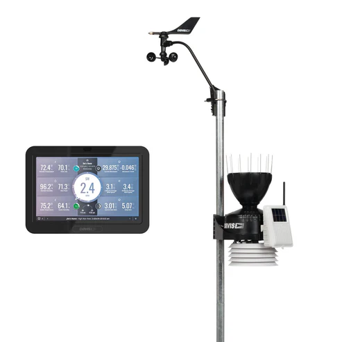
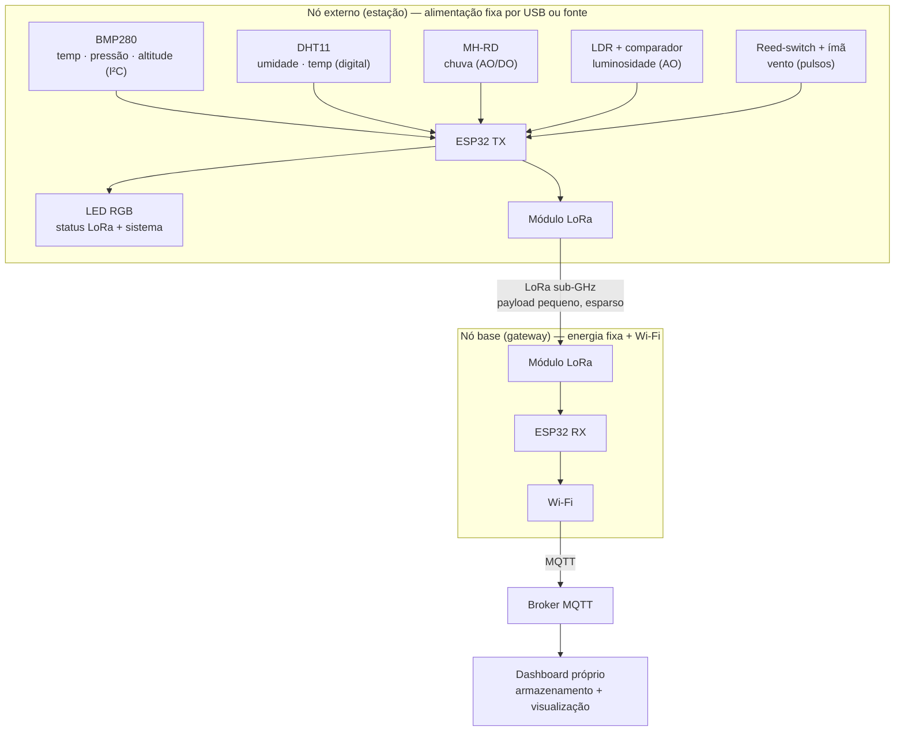

# Estação Meteorológica IoT com Enlace LoRa

### Estudo da Davis Vantage Pro2 e proposta de reprodução com ESP32

**Fundamentos de Sistemas Embarcados (FSE) — FGA/UnB — 2026.1 — Trabalho 2**

| Integrante | Matrícula |
|---|---|
| Bruno Bragança dos Reis | 221007902 |
| Pablo Serra Carvalho | 221008679 |
| João Paulo Barros de Cristo | 202023805 |
| Lucas Avelar | 200067095 |

---

## 1. Descrição do produto selecionado

O produto escolhido é a **Davis Vantage Pro2**, uma estação meteorológica sem fio de grau profissional fabricada pela Davis Instruments. Foi selecionada por dois motivos: tem documentação técnica relativamente aberta (manuais públicos e ampla comunidade de engenharia reversa do enlace de rádio) e, principalmente, porque sua arquitetura de **dois módulos** — um conjunto externo de sensores que transmite por rádio sub-GHz para um console interno — é o caso de uso canônico que pretendemos reproduzir com LoRa.

### Funções principais, público-alvo e contexto de uso

A Vantage Pro2 mede temperatura e umidade do ar, pressão barométrica, precipitação, velocidade e direção do vento, e — em versões Plus — radiação solar e índice UV, com atualização a cada 2,5 segundos. O público-alvo abrange entusiastas, agricultores, pesquisadores e estações de transmissão meteorológica, com sensores de precisão rastreável (NIST-traceable) adequados a uso profissional. O contexto de uso típico é a instalação do conjunto de sensores em área aberta (telhado, quintal, campo) com o console em ambiente interno.

### Componentes e sensores utilizados

O coração do produto é o **ISS (Integrated Sensor Suite)**, o conjunto externo alimentado por painel solar com bateria de respaldo (célula de lítio CR-123). Ele agrega:

- sensor de temperatura/umidade do ar (diodo de silício de junção PN) dentro de um abrigo de radiação;
- pluviômetro do tipo *tipping bucket* (báscula);
- anemômetro com **sensor magnético de estado sólido** para velocidade e potenciômetro no cata-vento para direção;
- opcionalmente, piranômetro (radiação solar) e sensor UV.

Esse detalhe do anemômetro é tecnicamente relevante para a reprodução: a medição de velocidade do vento se baseia em contagem de pulsos magnéticos por rotação, princípio reproduzível com uma chave magnética (reed-switch) e ímã.

### Tecnologias de comunicação e controle embarcadas

O ISS transmite os dados ao console por **rádio sub-GHz com salto de frequência (FHSS)**: 902–928 MHz na América do Norte e 868 MHz na Europa, com potência abaixo de 10 mW (operação isenta de licença) e alcance de até 300 m. O console (WeatherLink) processa, armazena e exibe os dados em tela, e — via **Wi-Fi** — faz upload para a nuvem WeatherLink, de onde os dados são acessados por web e aplicativo. O sistema, portanto, separa claramente dois domínios de comunicação: um enlace de rádio de longo alcance e baixo consumo entre sensores e base, e um enlace IP (Wi-Fi) entre base e nuvem.

---

## 2. Análise técnica do funcionamento

### Principais módulos do sistema

| Módulo | Função na Vantage Pro2 |
|---|---|
| **Sensoriamento** | Aquisição das grandezas ambientais no ISS (temperatura, umidade, pressão, chuva, vento, radiação) |
| **Controle (nó externo)** | Microcontrolador do ISS: amostra os sensores, formata o pacote e gerencia o rádio e a energia (solar + bateria) |
| **Conectividade RF** | Enlace FHSS sub-GHz ISS → console (longo alcance, baixo consumo) |
| **Interface (console)** | Tela do console: exibição local, gráficos, alarmes |
| **Conectividade IP** | Wi-Fi do console → nuvem WeatherLink |
| **Atuação** | Limitada; o produto é essencialmente de instrumentação/telemetria (alarmes e indicadores) |

### Identificação de tecnologias críticas

Três tecnologias são determinantes para a viabilidade do produto e orientam a reprodução:

**Rádio sub-GHz de longo alcance.** É o que permite separar fisicamente os sensores (onde o clima ocorre) do console (onde há energia e internet). O FHSS proprietário da Davis cumpre esse papel; na nossa reprodução, o **LoRa** ocupa esse lugar, com a vantagem de alcance ainda maior para payloads pequenos.

**Autonomia energética.** O nó externo opera por anos sem manutenção graças à combinação de painel solar, bateria de respaldo e um regime de operação em que o módulo passa a maior parte do tempo em baixo consumo, acordando apenas para amostrar e transmitir. Essa é a técnica de economia de energia central do produto.

**Telemetria para nuvem.** A ponte entre o mundo RF e a internet (no produto, o Wi-Fi do console para a nuvem WeatherLink) é o que transforma a estação em um dispositivo IoT. Na reprodução, esse papel é cumprido por **MQTT** sobre Wi-Fi.

---

## 3. Proposta de reprodução com ESP32

### Descrição conceitual

A reprodução adota fielmente a arquitetura de **dois nós** do produto original, substituindo o enlace FHSS proprietário por **LoRa** e a nuvem fechada por um **dashboard próprio**:

- **Nó externo (estação):** uma ESP32 conectada ao conjunto de sensores e alimentada por fonte fixa, cabo USB ou fonte de bancada. Periodicamente lê os sensores e transmite um pacote LoRa ao nó base. Cumpre o papel do ISS, mas sem reproduzir a autonomia energética do produto comercial.
- **Nó base (gateway):** uma ESP32 com receptor LoRa, instalada em local com energia e Wi-Fi. Recebe o pacote e o reencaminha por **MQTT** ao dashboard. Cumpre o papel do console.
- **Dashboard próprio:** plataforma web desenvolvida pelo grupo (broker MQTT, armazenamento e visualização), substituindo a nuvem WeatherLink por uma solução sob nosso controle.

A escolha do LoRa não é estética: a estação fica onde o tempo está, frequentemente longe do roteador, e o Wi-Fi não vence paredes e distâncias de dezenas a centenas de metros. O dado meteorológico é pequeno (poucos bytes) e esparso (a cada poucos minutos), perfil em que o LoRa é ideal e sua baixa banda é irrelevante. Esse casamento entre o problema de implantação e a tecnologia é o que torna a reprodução coerente com o produto real.

### Diagrama conceitual de blocos

### Mapeamento de sensores (componentes do ecossistema ESP32)

| Grandeza / função | Componente | Interface | Observação |
|---|---|---|---|
| Temperatura + pressão + altitude | BMP280 | I²C | Núcleo da estação; altitude derivada da pressão |
| Umidade + temperatura | DHT11 | Digital (1 fio) | Cobre umidade; redundância em temperatura |
| Chuva | MH-RD (módulo *raindrops*) | Analógico (AO) + digital (DO) | Detecção e intensidade de chuva |
| Luminosidade | LDR + módulo comparador | Analógico (AO) | Proxy de radiação solar; LDR em PCB separada, ligada por barramento ao módulo |
| Velocidade do vento | Reed-switch + ímã | Digital (contagem de pulsos) | Reproduz o princípio do anemômetro original |
| Indicação de status | Módulo LED RGB SMD (3 cores) | 3 GPIO (PWM) | No nó externo; sinaliza enlace LoRa e estado do sistema |

### Descrição dos componentes

**BMP280 (I²C).** Sensor barométrico da Bosch que mede pressão atmosférica e temperatura. A partir da pressão é possível estimar a altitude. É o núcleo da estação por entregar duas grandezas meteorológicas com boa precisão em um único encapsulamento de baixo custo. Não mede umidade (essa é a diferença para o BME280), por isso a umidade fica a cargo do DHT11.

**DHT11.** Sensor digital de umidade relativa e temperatura, com protocolo proprietário de um fio (single-wire). Fornece a umidade do ar — grandeza que o BMP280 não cobre — e uma leitura secundária de temperatura, útil como redundância. É um sensor econômico, com resolução e taxa de amostragem modestas (≈1 leitura/s e precisão da ordem de ±2 °C / ±5 % UR), coerente com o caráter de reprodução didática do projeto.

**LDR + módulo comparador (leitura analógica).** O LDR (resistor dependente de luz) tem resistência que cai conforme a luminosidade aumenta. No nosso hardware o LDR fica em uma PCB separada, conectada por um barramento ao módulo comparador; a ESP32 lê a **saída analógica (AO)** pelo ADC, obtendo um valor proporcional à luz incidente. Essa leitura proporcional funciona como *proxy* de radiação solar (o produto original usa um piranômetro). A saída digital do comparador (limiar claro/escuro) não é usada, pois interessa a intensidade e não apenas o estado liga/desliga.

**Reed-switch + ímã.** Chave magnética que fecha o contato quando o ímã passa próximo. Montada no eixo do anemômetro, gera um pulso por rotação; a ESP32 conta os pulsos por unidade de tempo para inferir a velocidade do vento. É exatamente o princípio do sensor magnético de estado sólido da Vantage Pro2. Requer resistor de *pull-up* e tratamento de *debounce* na aplicação.

**MH-RD (módulo *raindrops*).** Sensor de chuva composto por uma placa coletora (trilhas condutivas) e uma placa de controle com comparador. A presença de água reduz a resistência entre as trilhas. Usaremos a **saída analógica (AO)** para estimar a intensidade da chuva (quanto mais molhada a placa, maior o sinal) e a **saída digital (DO)** como detecção de limiar (chovendo / não chovendo).

**Módulo LED RGB SMD (indicador).** LED de três cores controlado por três GPIO da ESP32 (com PWM para compor cores). Fica no **nó externo (estação)** e serve como indicador visual de status, substituindo qualquer display local. Codifica dois conjuntos de estados: (i) o **enlace LoRa** — pacote transmitido com sucesso, aguardando, ou falha de transmissão; e (ii) o **estado do sistema** — inicialização/boot, operação normal e erro de leitura dos sensores. Cada situação é representada por uma cor/padrão de piscada, dando diagnóstico imediato em campo sem necessidade de tela.

### Limitações e desafios esperados

**LoRa ponto-a-ponto vs. LoRaWAN.** Usaremos LoRa cru (rádio direto entre os dois módulos), não LoRaWAN. Para um enlace único estação→base, o ponto-a-ponto é mais simples e suficiente; não há necessidade da camada de rede, gateways e servidor do LoRaWAN. Em contrapartida, perde-se confirmação de entrega (ACK) e endereçamento padronizados, que precisariam ser tratados na aplicação.

**Faixa de frequência e regulamentação.** Os módulos disponíveis operam em **433 MHz**, adequados para validação em bancada. Entretanto, a faixa ISM destinada a LoRa/LoRaWAN no Brasil pela ANATEL é a **AU915 (902–928 MHz)**. Um produto comercial nacional usaria 915 MHz por conformidade regulatória — exatamente a mesma faixa do ISS norte-americano da Davis.

**Calibração e precisão.** Sensores de baixo custo apresentam erro e deriva, ao contrário dos sensores rastreáveis da Vantage Pro2. A precisão resultante será inferior à do produto comercial.

**Robustez do enlace.** Perda de pacotes LoRa e ausência de ACK no modo ponto-a-ponto exigem estratégia de retransmissão ou tolerância a falhas na aplicação.

---

## 4. Pesquisa bibliográfica e tecnológica

### 4.1 Artigos sobre as tecnologias que viabilizam o produto

**[T1] A Study of LoRa: Long Range & Low Power Networks for the Internet of Things.**
Augustin, A.; Yi, J.; Clausen, T.; Townsley, W. M. *Sensors*, 2016, 16(9), 1466. doi:10.3390/s16091466 — https://www.mdpi.com/1424-8220/16/9/1466
Artigo de referência sobre a camada física do LoRa, baseada em modulação por espalhamento espectral em *chirps* (CSS). Caracteriza os parâmetros fundamentais (fator de espalhamento, largura de banda, taxa de codificação) e o compromisso entre alcance, taxa de dados e consumo. Fundamenta tecnicamente a escolha do LoRa como enlace de longo alcance do nó externo da estação.

**[T2] LoRaWAN Mesh Networks: A Review and Classification of Multihop Communication.**
Cotrim, J. R.; Kleinschmidt, J. H. *Sensors*, 2020, 20(15), 4273. doi:10.3390/s20154273 — https://www.mdpi.com/1424-8220/20/15/4273
Revisão (de autores brasileiros) sobre topologias e comunicação multissalto em redes LoRaWAN. Esclarece a distinção entre o LoRa de camada física e a camada de rede LoRaWAN, e quando arquiteturas mais complexas se justificam — embasando nossa decisão consciente por um enlace ponto-a-ponto simples nesta etapa.

**[T3] Performance Evaluation of Different Raspberry Pi Models as MQTT Servers and Clients.**
Ford, T. N.; Gamess, E.; Ogden, C. *International Journal of Computer Networks & Communications (IJCNC)*, 2022, 14(2), 1–18. doi:10.5121/ijcnc.2022.14201 — https://aircconline.com/abstract/ijcnc/v14n2/14222cnc01.html
Avaliação empírica do protocolo MQTT com o broker Mosquitto, variando nível de QoS, tamanho de payload e hardware. É diretamente aplicável ao nosso dashboard próprio: orienta a escolha de QoS e o dimensionamento de um broker MQTT em hardware de baixo custo para a telemetria da estação.

**[T4] Towards Self-Powered WSN: The Design of Ultra-Low-Power Wireless Sensor Transmission Unit Based on Indoor Solar Energy Harvester.**
Md Din, N.; et al. *Electronics*, 2022, 11(13), 2077. doi:10.3390/electronics11132077 — https://www.mdpi.com/2079-9292/11/13/2077
Projeto de uma unidade de transmissão sem fio de consumo ultrabaixo que combina captação de energia solar e LoRa, com medições de consumo em modo dormente versus ativo. Sustenta o orçamento energético do nó externo: demonstra a viabilidade da operação solar + LoRa + *deep sleep* que propomos.

### 4.2 Artigos sobre a aplicação / uso do produto

**[A1] Design and Validation of a Solar-Powered LoRa Weather Station for Environmental Monitoring and Agricultural Decision Support.**
Martínez-Blanco, M. del R.; et al. *Technologies*, 2026, 14(1), 32. doi:10.3390/technologies14010032 — https://www.mdpi.com/2227-7080/14/1/32
Estação meteorológica de baixo custo praticamente idêntica à nossa proposta: módulo de sensores (temperatura, umidade, pressão, radiação, vento, chuva) transmitindo por LoRa a um console local com Wi-Fi, validada em campo por um mês contra medições de referência. É o artigo mais próximo do projeto e valida a arquitetura de dois nós com enlace LoRa.

**[A2] The Potential of Low-Cost IoT-Enabled Agrometeorological Stations: A Systematic Review.**
Dragonetti, G.; et al. *Sensors*, 2025, 25(19), 6020. doi:10.3390/s25196020 — https://www.mdpi.com/1424-8220/25/19/6020
Revisão sistemática de estações meteorológicas IoT de baixo custo, evidenciando a adoção predominante da ESP32 e o uso crescente de LoRa e Wi-Fi pelo equilíbrio entre alcance, consumo e escalabilidade. Situa nossa proposta no estado da arte e aponta desafios recorrentes (calibração, interoperabilidade, validação de campo).

**[A3] Evaluation of LoRa Technology in Flooding Prevention Scenarios.**
Cecílio, J.; Ferreira, P. M.; Casimiro, A. *Sensors*, 2020, 20(14), 4034. doi:10.3390/s20144034 — https://www.mdpi.com/1424-8220/20/14/4034
Avaliação do LoRa em monitoramento ambiental para prevenção de enchentes, medindo alcance e confiabilidade em condições reais de campo. Exemplifica o uso do LoRa exatamente no contexto da nossa aplicação — sensoriamento ambiental remoto — e ajuda a antecipar limitações do enlace.

**[A4] LoRa based intelligent soil and weather condition monitoring with Internet of Things for precision agriculture in smart cities.**
Singh, D. K.; Sobti, R.; Jain, A.; Malik, P. K.; Le, D.-N. *IET Communications*, 2022. doi:10.1049/cmu2.12352 — https://ietresearch.onlinelibrary.wiley.com/doi/full/10.1049/cmu2.12352
Estação meteorológica baseada em LoRa para agricultura de precisão que monitora condições de solo e clima e envia os dados à nuvem, comparando-se a estações comerciais. Demonstra a aplicação prática do produto reproduzido e oferece base para o comparativo com produtos de mercado.

---

## 5. Comparativo com produtos similares

Todas as estações de mercado da categoria compartilham o mesmo padrão arquitetural: um conjunto de sensores externo (geralmente solar) que transmite por **rádio sub-GHz** a um console/gateway interno, que por sua vez sobe os dados à internet por Wi-Fi. É justamente esse padrão que a nossa reprodução com LoRa busca recriar.

| Produto | Arquitetura | Enlace sensor ↔ base | Conectividade externa | Energia do nó externo | Display local |
|---|---|---|---|---|---|
| **Davis Vantage Pro2** *(estudado)* | ISS externo + console | Rádio FHSS 902–928 / 868 MHz, até 300 m | Wi-Fi → nuvem WeatherLink | Solar + bateria CR-123 | Sim (console) |
| **Ecowitt WS3800 + WS90** | Array externo + console/gateway | Rádio 915 / 868 / 433 MHz | Wi-Fi → Ecowitt.net (+ servidor próprio) | Solar + bateria | Sim (LCD) |
| **AcuRite Optimus (01224)** | Sensor 5-em-1 + display Wi-Fi | Rádio 433 MHz | Wi-Fi → AcuRite | Solar + bateria | Sim |
| **La Crosse V42-PRO** | Sensores + console Wi-Fi | Rádio 915 MHz, ~120 m | Wi-Fi → La Crosse View | Bateria (solar opc.) | Sim |
| **Ambient Weather WS-2902** | Array externo + console | Rádio 915 MHz | Wi-Fi → Ambient Weather Network | Solar + bateria | Sim |
| **Netatmo Smart Weather Station** | Módulos interno + externo | Rádio 915 / 868 MHz | Wi-Fi → nuvem Netatmo | Pilhas (sem solar) | Não (só app) |
| **WeatherFlow Tempest** | Estação tudo-em-um + hub | Rádio 915 MHz | Wi-Fi (hub) → nuvem Tempest | Solar | Não (só app) |

Observações do comparativo: (i) o uso de rádio sub-GHz no enlace de sensores é universal na categoria — confirma que reproduzir esse enlace com LoRa é fiel ao produto real, e não um acréscimo artificial; (ii) a faixa de 915 MHz domina o mercado norte-americano e coincide com a faixa AU915 regulamentada no Brasil; (iii) a alimentação solar do nó externo é a norma, reforçando a relevância da gestão de energia; (iv) a maioria depende de nuvem proprietária — ponto em que nossa proposta se diferencia ao adotar um dashboard próprio.

---

## Referências

As referências dos artigos acadêmicos estão listadas na Seção 4, cada uma com DOI e link. As informações técnicas do produto e dos similares foram levantadas nas seguintes fontes:

- Davis Instruments — *Vantage Pro2*: https://www.davisinstruments.com/pages/vantage-pro2
- Davis Instruments — *Integrated Sensor Suite (ISS) User Manual* (especificações de rádio 902–928 / 868 MHz, energia solar, sensores)
- Ecowitt — *WS3800/WS3900* e *WS90*: https://shop.ecowitt.com/products/ws3800-ws3900
- AcuRite, La Crosse Technology, Ambient Weather e WeatherFlow Tempest — páginas oficiais de especificação dos respectivos produtos.

