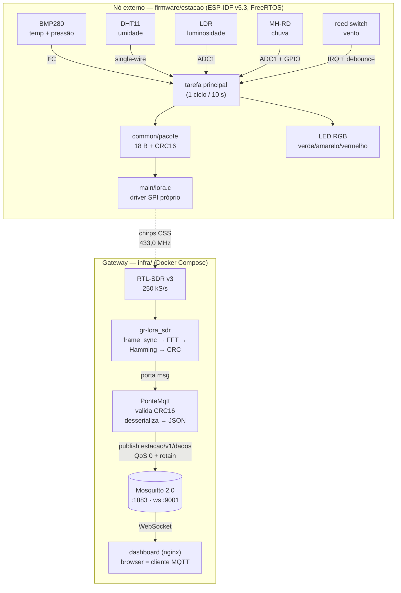
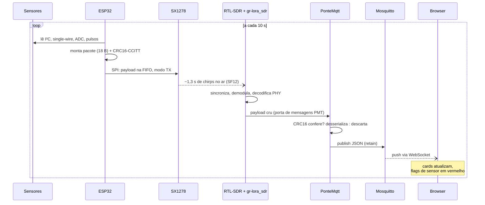

# Arquitetura

## Visão geral

Dois "mundos" ligados por rádio: o **nó externo** (ESP32, sem nenhuma
infraestrutura além de alimentação) e o **gateway** (o PC, onde tudo é
software em containers). A decisão de arquitetura mais importante do
projeto está no meio: sem um segundo módulo LoRa, o receptor é um
RTL-SDR com o PHY LoRa implementado em GNU Radio (`docs/08-lora.md`
conta essa história).

## A vida de um pacote

## Tolerância a falhas (herdada da Fase 3)

- **Sensor falhou** → bit em `flags`, campo zerado, pacote sai mesmo
  assim; o dashboard pinta o card do sensor de vermelho.
- **Rádio mudo no boot** → `[SELFTEST] lora FALHA`, LED vermelho, e a
  estação segue lendo sensores e logando (sem TX).
- **Pacote corrompido no ar** → o CRC16 fim-a-fim não confere na ponte;
  vira contador de descarte, nunca dado falso no broker.
- **Broker caiu** → paho reconecta sozinho; o `retain` repõe o último
  estado para qualquer assinante novo.

## Dois CRCs, de propósito

| CRC | Quem calcula | O que protege |
|---|---|---|
| CRC do quadro LoRa | SX1278 (TX) / gr-lora_sdr (RX) | só o trecho aéreo |
| CRC16-CCITT do pacote | firmware (TX) / PonteMqtt (RX) | fim-a-fim: rádio, decodificador, broker, banco futuro |

## Decisões de arquitetura registradas

1. **Gateway em software (SDR)** — sem segundo Ra-02; o PHY LoRa roda
   em GNU Radio dentro de container ([08 — LoRa](08-lora.md)).
2. **JSON único em `estacao/v1/dados`** — Telegraf/Grafana futuros
   consomem sem mudar nada ([09 — MQTT](09-mqtt.md)).
3. **Browser como cliente MQTT** — dashboard sem backend, via listener
   WebSocket do Mosquitto ([10 — Dashboard](10-dashboard.md)).
4. **Reprodutibilidade** — toolchain, imagens e dependências fixadas
   por versão/commit; tudo sobe com `make`.
