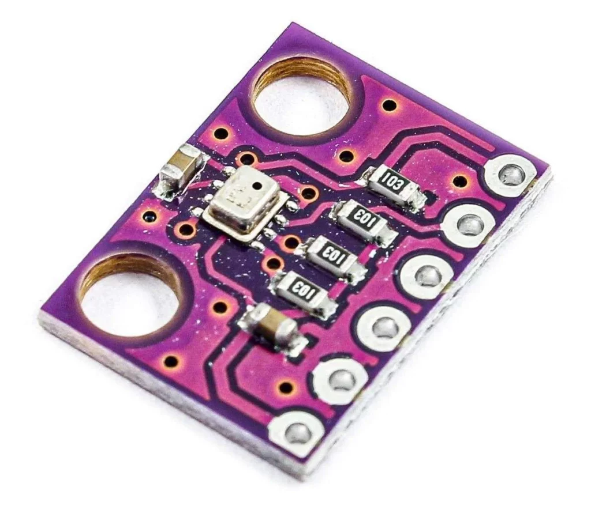

# BMP280 — temperatura e pressão

{ width="320" }

## O que é

Sensor digital da Bosch que mede **temperatura** e **pressão
barométrica** no mesmo chip. Cada unidade sai de fábrica com 12
coeficientes de calibração gravados na memória interna; o firmware lê
esses coeficientes e aplica o polinômio de compensação do
[datasheet](../assets/BMP280_Datasheet.pdf) para converter as contagens
brutas do ADC em °C e Pa.

## Conexão com o ESP32

| Pino do módulo | ESP32 | Nota |
|---|---|---|
| VCC | 3V3 | |
| GND | GND | |
| SCL | GPIO 22 | clock do I²C |
| SDA | GPIO 21 | dados do I²C |
| CSB | — | desconectado (a plaquinha do módulo já seleciona modo I²C) |
| SDO | — | desconectado (a plaquinha define o endereço; respondeu em **0x76**) |

## Comunicação

**I²C** a 400 kHz — barramento de 2 fios (SDA/SCL) compartilhado, com
endereçamento de 7 bits. Conversar com o sensor é ler/escrever
registradores: ID em `0xD0`, calibração em `0x88–0xA1`, configuração em
`0xF4`, dados em `0xF7–0xFC`.

## Diagnóstico registrado: módulo defeituoso

O primeiro módulo comprado não respondia no barramento (nenhum ACK no
scanner I²C); a troca por outro módulo resolveu. A investigação
completa está no diário: [01 — BMP280](../diario_bordo/01-bmp280.md).
