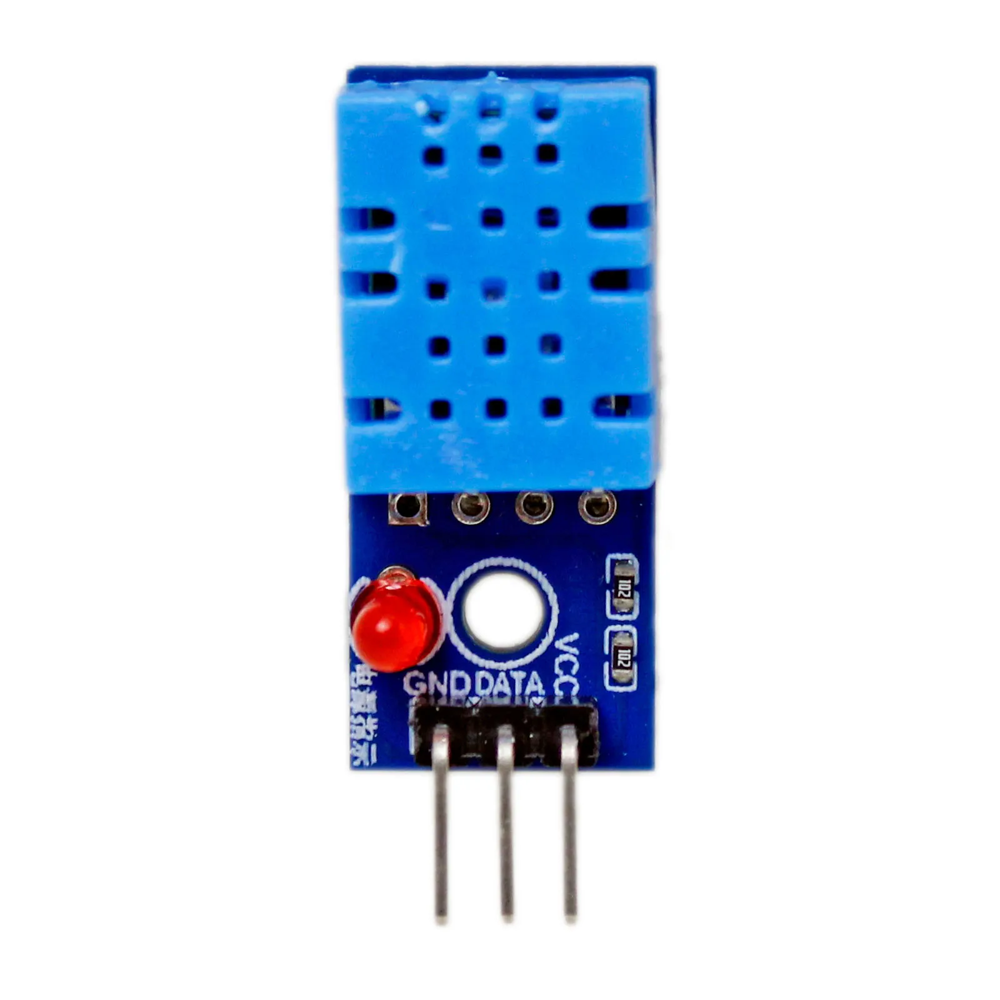

# DHT11 — umidade relativa

{ width="320" }

## O que é

Sensor de **umidade relativa** (e temperatura, com resolução grosseira
de 1 °C — no projeto a temperatura fica a cargo do BMP280). Usado na
versão módulo de 3 pinos, que já traz o resistor de pull-up na
plaquinha.

## Conexão com o ESP32

| Pino do módulo | ESP32 | Nota |
|---|---|---|
| VCC | 3V3 | |
| DAT | GPIO 4 | linha única de dados |
| GND | GND | |

## Comunicação

**Protocolo proprietário de 1 fio** (single-wire, bidirecional): o MCU
segura a linha em nível baixo ~20 ms para "acordar" o sensor, que
responde com 40 bits onde **cada bit é codificado pela duração do pulso
alto** (~27 µs = 0, ~70 µs = 1). Não é o 1-Wire da Dallas nem I²C — é
um protocolo só do DHT.
