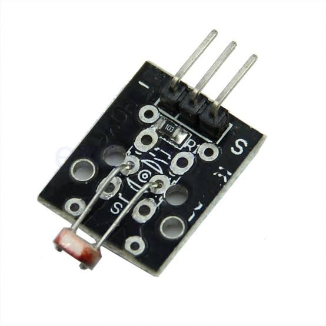

# LDR KY-018 — luminosidade

{ width="320" }

## O que é

Resistor dependente de luz (**LDR**): quanto mais luz, menor a
resistência. O módulo KY-018 monta o LDR em **divisor de tensão** com
um resistor fixo, então a luminosidade vira uma tensão analógica no
pino de sinal.

## Conexão com o ESP32

| Pino do módulo | ESP32 | Nota |
|---|---|---|
| S | GPIO 34 | ADC1_CH6, pino somente entrada |
| + | 3V3 | |
| − | GND | |

## Comunicação

**Sinal analógico** lido pelo **ADC1** do ESP32 (12 bits, atenuação de
12 dB, média de 16 amostras no firmware). O analógico do projeto fica
todo no ADC1 porque o ADC2 conflita com o Wi-Fi.

## Diagnóstico registrado: LDR soldado nos furos errados

O módulo comprado veio com o LDR soldado nos furos **da borda, não
conectados** ao circuito — os furos corretos (`S1`, no centro) estavam
vazios. O teste do jumper (3V3 direto no GPIO 34 → leitura 4095) provou
que ADC e firmware estavam certos antes de culpar o hardware. História
completa no diário: [02 — LDR](../diario_bordo/02-ldr.md).
