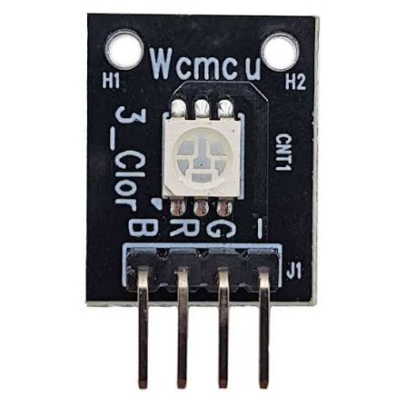

# LED RGB — status da estação

{ width="320" }

## O que é

Módulo com um LED de três cores usado como **indicador de status** da
estação: verde (tudo bem), amarelo (degradado — algum sensor falhou),
vermelho (falha grave, ex.: rádio mudo no boot). É o único componente
de **saída** entre os periféricos de bancada.

## Conexão com o ESP32

| Pino do módulo | ESP32 | Nota |
|---|---|---|
| R | GPIO 16 | silkscreen da placa mostra `RX2` |
| G | GPIO 17 | silkscreen da placa mostra `TX2` |
| B | GPIO 13 | |
| − | 3V3 | o fabricante marcou "−", mas o comum é **anodo** (vai no 3V3) |

## Comunicação

Não há protocolo: são **três canais de PWM** gerados pelo periférico
**LEDC** do ESP32 (1 timer a 5 kHz, 8 bits de resolução, 3 canais). O
duty cycle de cada canal define o brilho de cada cor; o olho enxerga a
média do liga-desliga rápido.

## Lógica invertida resolvida em hardware

Como o comum é anodo, acender exige nível **baixo** no GPIO — em vez de
inverter contas no código, o canal LEDC é configurado com
`flags.output_invert = 1` e o resto do firmware pensa em "quanto maior,
mais brilho". Detalhes no diário:
[06 — LED RGB](../diario_bordo/06-led-rgb.md).
