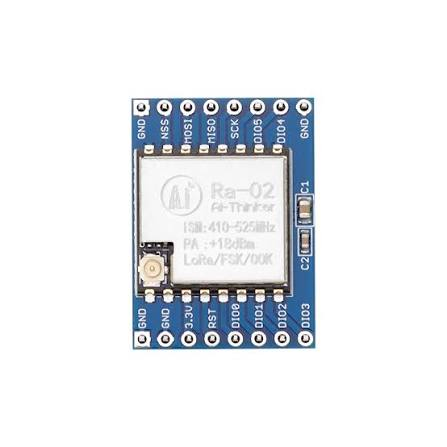

# LoRa Ra-02 (SX1278) — rádio

{ width="320" }

## O que é

Módulo de rádio da Ai-Thinker com o transceptor **Semtech SX1278**,
operando em **433 MHz** com modulação LoRa (chirps CSS) — o enlace de
longo alcance entre a estação e o gateway SDR. Configuração do projeto:
433,0 MHz, SF12, BW 125 kHz, PA_BOOST a +2 dBm (potência mínima como
política de bancada).

**Regra de ouro: nunca transmitir sem antena** — em potência alta, a
energia refletida pode queimar o amplificador de saída (PA).

## Conexão com o ESP32

| Pino do módulo | ESP32 | Nota |
|---|---|---|
| 3.3V | 3V3 | NUNCA em 5 V |
| GND (×2) | GND | os dois GNDs ligados — retorno de RF |
| SCK | GPIO 18 | VSPI |
| MISO | GPIO 19 | VSPI |
| MOSI | GPIO 23 | VSPI |
| NSS | GPIO 5 | chip select, conduzido pelo driver SPI |
| RST | GPIO 14 | reset por hardware no boot |
| DIO0 | GPIO 26 | IRQ TxDone/RxDone (reservado; TX atual usa polling) |

## Comunicação

Dois planos distintos: com o **ESP32**, o SX1278 fala **SPI** (VSPI a
1 MHz) — o firmware escreve o payload na FIFO e configura registradores
do modem. **Pelo ar**, o chip modula esses bytes em chirps LoRa a
433 MHz, que o gateway (RTL-SDR + gr-lora_sdr) demodula por software.

## Cadeia de RF

Do chip até o ar: `Ra-02 → conector IPEX → pigtail SMA → filtro BPF
433 MHz → antena`. A lição registrada: *rosca engatada não prova
contato* — gênero de conector (SMA vs RP-SMA) e o miolo pino/furo é que
decidem. Diário completo: [08 — LoRa](../diario_bordo/08-lora.md).
