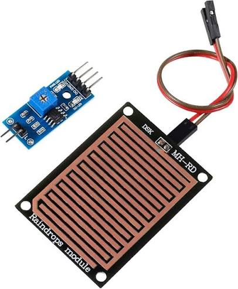

# MH-RD — sensor de chuva (pente + LM393)

{ width="320" }

## O que é

Sensor de chuva em duas partes: o **pente** (placa com trilhas
intercaladas que a água curto-circuita — quanto mais molhado, menor a
resistência) e a **placa comparadora com LM393**, que entrega duas
saídas: a analógica AO (intensidade) e a digital DO (limiar ajustado no
trimpot).

## Conexão com o ESP32

| Pino | ESP32 | Nota |
|---|---|---|
| Pente → placa | + / − | dois fios entre o pente e a comparadora |
| VCC | 3V3 | |
| GND | GND | |
| A0 | GPIO 35 | ADC1_CH7, pino somente entrada |
| D0 | GPIO 27 | saída do comparador (nível baixo = molhado) |

## Comunicação

Dupla: **analógica** (AO no ADC1, 12 dB, média de 16 amostras — a
intensidade bruta `chuva_raw`) e **digital** (DO como GPIO de entrada —
o LM393 compara AO com o limiar do trimpot e crava chovendo/seco).

## Limitação registrada

A interpretação do AO (garoa vs chuva forte, deriva por oxidação do
pente) exige calibração em campo; na bancada o firmware transmite o
valor cru e o limiar digital. Detalhes no diário:
[03 — Chuva](../diario_bordo/03-chuva.md).
