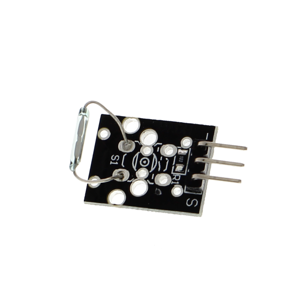

# Reed switch KY-021 — vento

{ width="320" }

## O que é

Interruptor magnético: duas lâminas dentro de uma ampola de vidro que
se fecham quando um ímã se aproxima. No anemômetro real, os copos giram
com o vento e um ímã no eixo passa pelo reed uma vez por volta —
**pulsos por minuto viram velocidade do vento**. Na bancada, o pulso é
simulado aproximando um ímã (ou fechando GND→S com jumper).

## Conexão com o ESP32

| Pino do módulo | ESP32 | Nota |
|---|---|---|
| S | GPIO 25 | entrada com interrupção |
| + | 3V3 | |
| − | GND | |

## Comunicação

**Pulsos digitais por interrupção (ISR)**: borda de descida no GPIO 25,
pull-up interno do ESP32 (em paralelo com o 10 kΩ da plaquinha) e
contador atômico lido-e-zerado a cada ciclo de medição.

## Debounce: o detalhe que importa

Lâminas mecânicas "quicam" ao fechar — um toque vira dezenas de bordas
elétricas. O firmware aplica **debounce de 10 ms dentro da ISR**:
bordas mais próximas que isso são ignoradas. A validação com o dedo
(fonte severa de bounce) está no diário:
[05 — Vento](../diario_bordo/05-vento.md).
