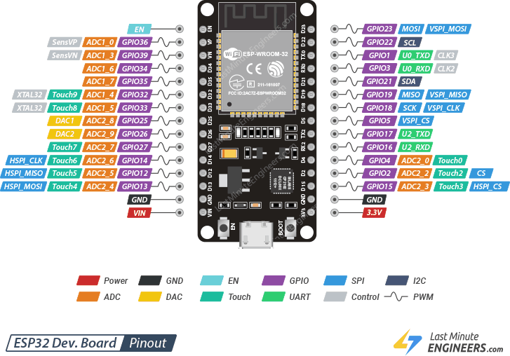
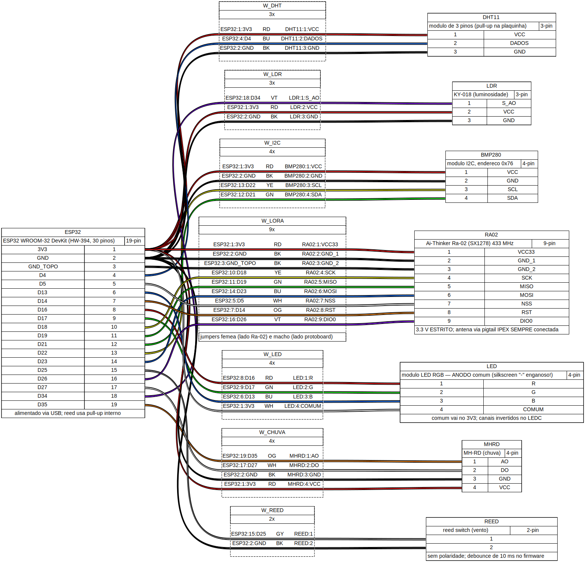
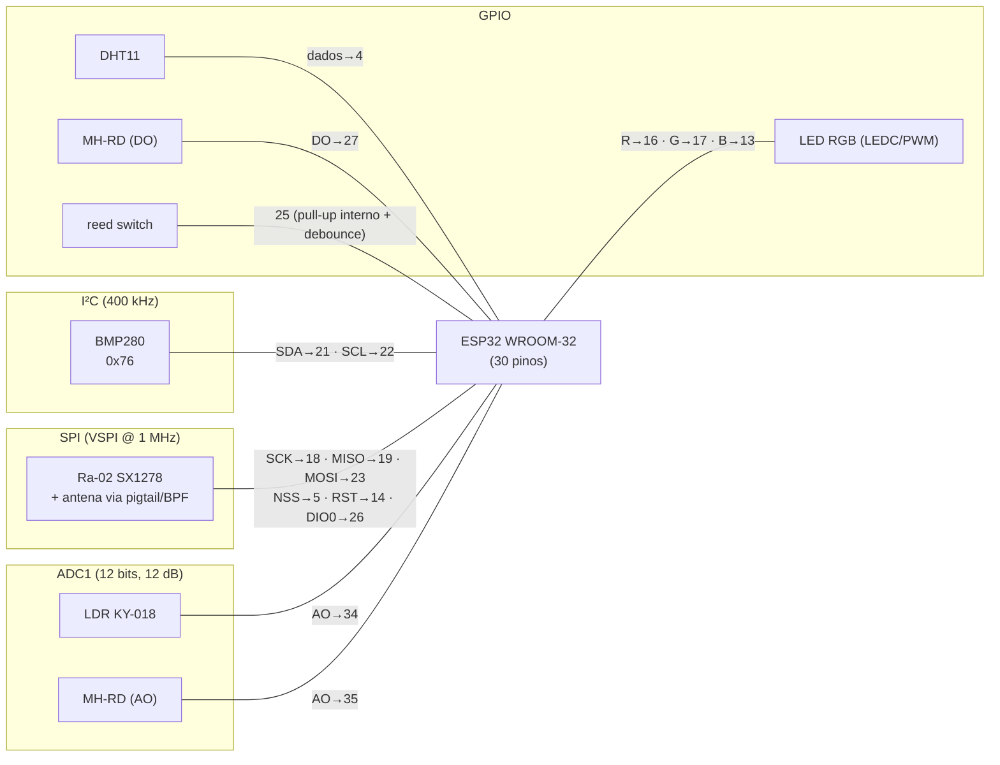
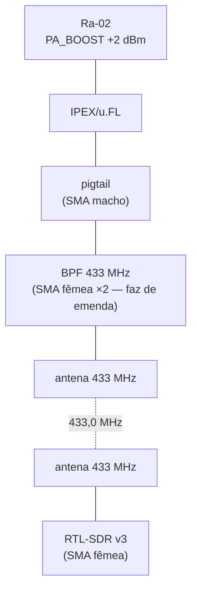
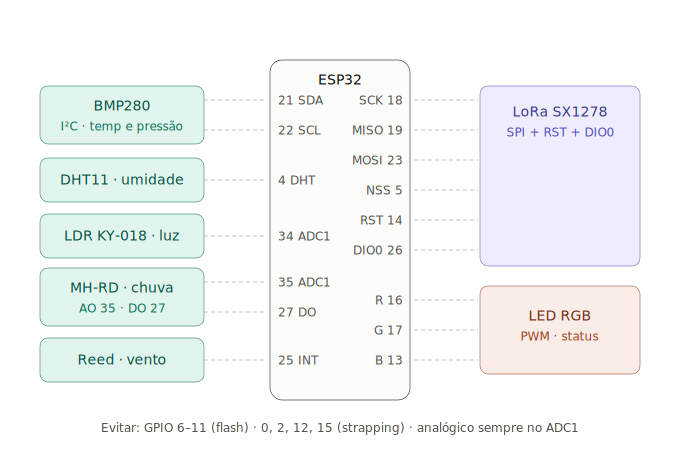

# Conexões do hardware

A definição dos componenetes foi feita antes do desenvolvimento do firmaware,
basta ver em [Pinagem](./pinagem.md).
Esta página apresenta a topologia — o que liga em quê, por qual barramento.

## ESP32

## Diagrama de fiação (WireViz)

Gerado a partir de [`docs/wireviz/estacao.yml`](https://github.com/BrunoBReis/trabalho_embarcados/blob/main/docs/wireviz/estacao.yml)
com o [WireViz](https://github.com/wireviz/WireViz) — mexeu na fiação.

!!! note "Por que duas visões?"
    O WireViz mostra o *chicote físico* (fio a fio, com cores e
    numeração de pinos); o Mermaid abaixo mostra a *topologia lógica*
    (quem fala com quem, por qual barramento). A tabela mais abaixo
    continua sendo o contrato canônico.

## Topologia por barramento

## Tabela canônica

| Função | GPIO | Nota |
|---|---|---|
| I²C SDA (BMP280) | 21 | |
| I²C SCL (BMP280) | 22 | |
| DHT11 dados | 4 | módulo de 3 pinos (pull-up na plaquinha) |
| LDR AO | 34 | ADC1_CH6, somente entrada |
| MH-RD AO | 35 | ADC1_CH7, somente entrada |
| MH-RD DO | 27 | opcional (limiar do trimpot) |
| Reed switch | 25 | interrupção + pull-up interno + debounce 10 ms |
| LoRa SCK | 18 | VSPI |
| LoRa MISO | 19 | VSPI (pull-up de diagnóstico no driver) |
| LoRa MOSI | 23 | VSPI |
| LoRa NSS (CS) | 5 | conduzido pelo driver SPI |
| LoRa RST | 14 | reset por hardware no boot |
| LoRa DIO0 | 26 | IRQ TxDone/RxDone (reservado; TX atual usa polling) |
| LED R / G / B | 16 / 17 / 13 | PWM via LEDC; módulo anodo comum |

**Alimentação:** tudo em **3V3**; Ra-02 com dois
GNDs ligados.

## Cadeia de RF

## Mapa visual da placa

