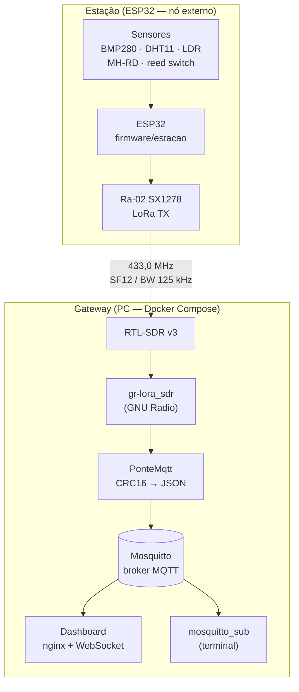

# Estação Meteorológica IoT

Reprodução didática da arquitetura da **Davis Vantage Pro2** para a
disciplina de Fundamentos de Sistemas Embarcados (FGA/UnB): um nó
externo (ESP32 + sensores) transmite por **LoRa 433 MHz**, e a base
recebe via **RTL-SDR + GNU Radio em Docker**, publica em **MQTT** e
exibe num **dashboard** no browser.



## Pipeline em números

| Etapa | Detalhe |
|---|---|
| Pacote | 18 bytes binários, ponto fixo, CRC16-CCITT fim-a-fim |
| Enlace | LoRa 433,0 MHz, SF12/BW125, +2 dBm (bancada), ~1,3 s no ar |
| Intervalo | 1 pacote a cada 10 s (bancada; 30 s produção) |
| Recepção | RTL-SDR v3 a 250 kS/s → cadeia `gr-lora_sdr` em container |
| Publicação | JSON em `estacao/v1/dados`, QoS 0 + retain |

## Como rodar

```bash
make run          # grava e monitora a estação (placa conectada)
make infra-up     # sobe broker + receptor SDR + dashboard
make mqtt-sub     # vê os dados chegando no broker
# dashboard: http://localhost:8080
```

## Protoboard


## Esta documentação

Servida com MkDocs Material em container, sem instalar nada no host:

```bash
make docs-serve   # http://localhost:8000 (live reload ao editar docs/)
make docs-build   # gera o site estático em site/
```

- **[Arquitetura](arquitetura.md)** — os diagramas de como tudo se conecta
- **[Conexões do hardware](conexoes.md)** — cada fio da protoboard
- [**Componentes**](./componentes/index.md) - detalhamento dos componentes
- **[Plano e próximos passos](plano.md)** — o roteiro por fases, ao vivo
- **[Diário de bordo](diario_bordo/index.md)** — a história real de
  cada etapa, com os problemas e as soluções (a parte mais valiosa para
  quem quiser reproduzir)
